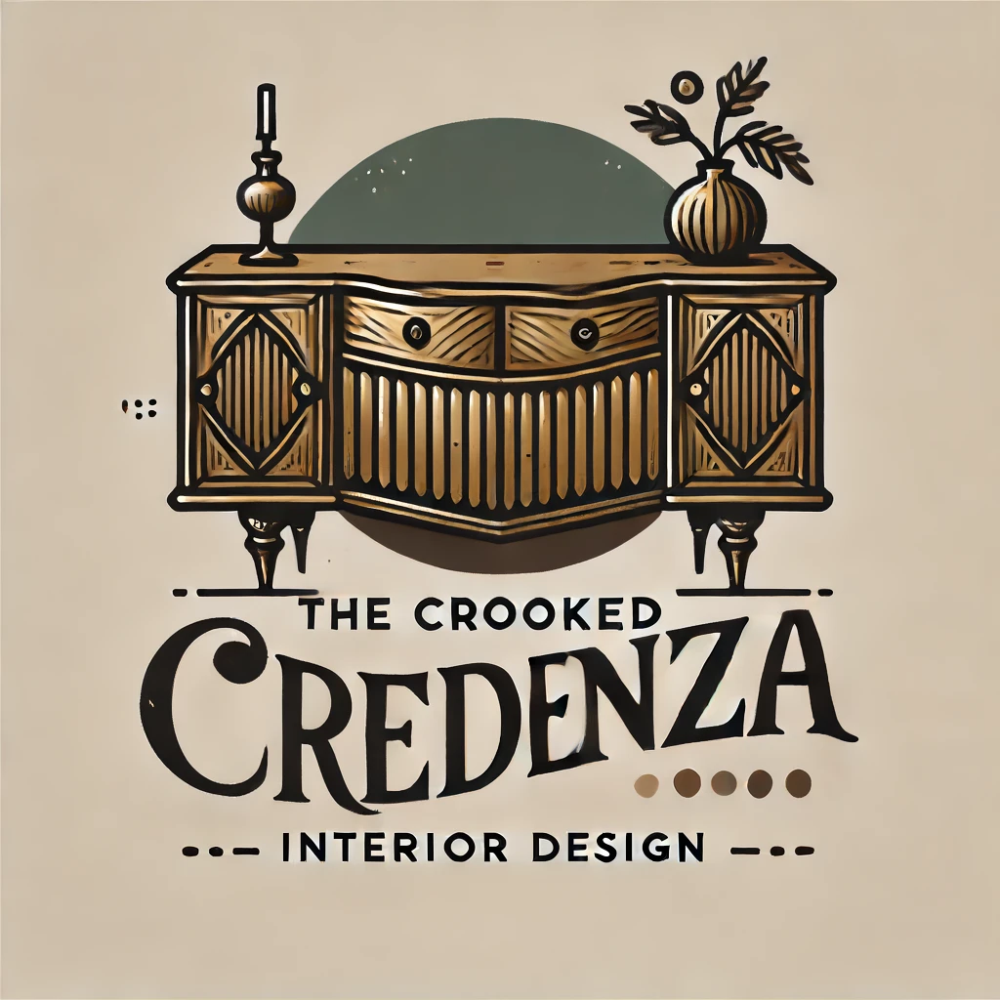

<p align="center">
  
</p>

# The Crooked Credenza

Welcome to **The Crooked Credenza** project! This repository houses the code for an eclectic, stylish, and modern interior design website. Our aim is to showcase the best of interior design while providing an engaging user experience.

## Project Overview

**The Crooked Credenza** is a beautifully designed website that highlights the unique style of our interior design business. It features a clean, modern layout with interactive elements and animations that make exploring our portfolio a delightful experience.

### Features

- **Stunning Portfolio**: Browse through our eclectic collection of interior design projects, each with detailed descriptions and high-quality images.
- **Personalized Services**: Discover the bespoke services we offer, from interior design consultations to full-scale renovations.
- **Interactive Blog**: Stay updated with the latest design trends and tips through our regularly updated blog.
- **Engaging Animations**: Enjoy smooth and eye-catching animations powered by AOS (Animate On Scroll).
- **Responsive Design**: The website is fully responsive, ensuring a seamless experience across all devices.
- **Smooth Navigation**: Easily navigate the site with our intuitive and user-friendly menu.

## Getting Started

To get started with the project, follow these steps:

1. **Clone the repository**:
    ```bash
    git clone https://github.com/yourusername/the-crooked-credenza.git
    cd the-crooked-credenza
    ```

2. **Open the project**:
    Open the project in your favorite code editor.

3. **Run a local server**:
    Use a local server extension or tool to view the project in your browser (e.g., Live Server in VS Code).

4. **Explore the code**:
    - **HTML**: The main HTML files are located in the root directory and in the `image-details` and `projects` folders.
    - **CSS**: Styles are in the `styles.css` file.
    - **JavaScript**: Scripts for interactivity and animations are in the `js/main.js` file.

## Usage

To use the website, navigate to `index.html` in your browser. Explore our portfolio, learn about our services, read our blog, and contact us through the interactive forms.

### Navigation

- **Home**: The main landing page showcasing our brand.
- **Portfolio**: A detailed view of our projects.
- **Services**: Information on the services we offer.
- **About**: Meet Brian, our talented designer.
- **Blog**: Stay updated with design trends and tips.
- **Contact**: Reach out to us with your design inquiries.
- **Testimonials**: Hear what our clients have to say.

### Interactivity

- **Menu Toggle**: On smaller screens, use the menu toggle button to open and close the navigation menu.
- **Clickable Images**: Click on any project or side image to learn more about it on a dedicated page.
- **Smooth Scrolling**: Enjoy smooth scrolling to different sections of the site.

## Technologies Used

- **HTML5**: The standard markup language for creating web pages.
- **CSS3**: Styling language used for designing the website layout.
- **JavaScript**: Programming language for interactive elements.
- **AOS (Animate On Scroll)**: Library for adding animations on scroll.
- **FontAwesome**: Icons for social media links and other visual elements.
- **Google Fonts**: Custom fonts to enhance the site's typography.

## Contributing

We welcome contributions to improve **The Crooked Credenza**! If you have suggestions, bug fixes, or new features, feel free to open an issue or submit a pull request.

### Steps to Contribute

1. **Fork the repository**.
2. **Create a new branch**:
    ```bash
    git checkout -b feature/your-feature-name
    ```
3. **Make your changes**.
4. **Commit your changes**:
    ```bash
    git commit -m "Add your message here"
    ```
5. **Push to the branch**:
    ```bash
    git push origin feature/your-feature-name
    ```
6. **Open a pull request**.

## License

This project is licensed under the MIT License - see the [LICENSE](LICENSE) file for details.

## Contact

For any inquiries or feedback, please reach out to us:

- **Email**: your-email@example.com
- **Facebook**: [Crooked Credenza](https://www.facebook.com/people/Crooked-Credenza/61556984696458/)
- **Instagram**: [@crookedcredenza](https://www.instagram.com/crookedcredenza/)
- **Nextdoor**: [The Crooked Credenza](https://www.nextdoor.com)

---

Thank you for visiting **The Crooked Credenza** project! We hope you enjoy exploring our work as much as we enjoyed creating it.